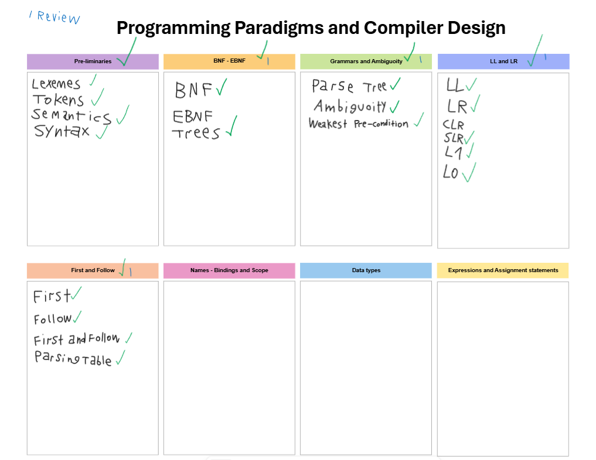

# Programming-Paradigms
Projects for "501427-3 | Programming Paradigms" Course in Taif University

### Syllabus

1. Pre-Liminaries (Lexer - Syntax Analyzer - Lexemes)
2. BNF - EBNF
3. Grammars and Ambiguoity
4. LL and LR
5. First and Follow - Parsing Tables
6. Names , Bindings and Scopes
7. Data Types
8. Expressions and Assignments statements

### Related Subjects
- Compiler Design
- OOP
- Analysis and Design Algorithms
