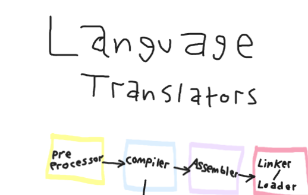
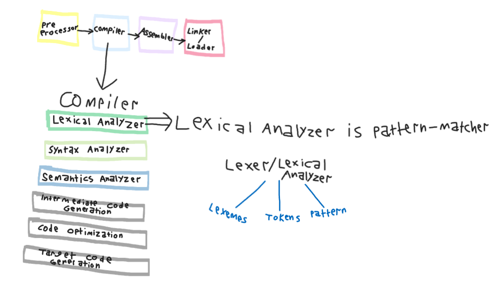

# Extras

- Language : Set of sentence.

- Sentence : String of characters over an alphabet.

- Syntax Rule : A Hierarchical structure of programming language.

- Syntax : a Form or structure of statements , expressions and program units

- Semantics : Meaning of statements , expressions and Program units

- Token : Category of lexemes

- Lexemes and Tokens is smallest unit of Syntax.

- Lexemes are lowest level of language.

### Note :

Parsing = إعراب

Lexemes = مُفردات

# Language translator

# Compiler

- Lexical Analyzer is pattern-matcher

Lexer results : (Lexemes - Tokens - Pattern)